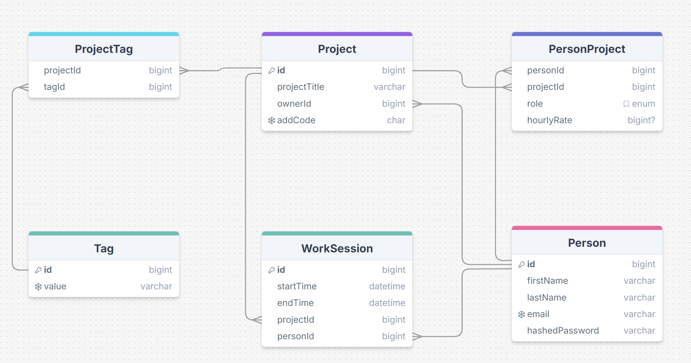

## Description
This project tracks time worked, project contributors, roles, hourly rates, and project tags in a collaborative environment.

## Questions

| Question                                       |  Did GPT generate working SQL?  | Was the answer accurate? |
|------------------------------------------------|---------------------------------|------------------|
| What is the total cost of the Data Migration Project?  | Yes                  | Yes               |
| Who worked on Campus Kiosk App on May 31?      | Yes                  | No. GPT said it didn't have access to the data, when in reality,there were simply no entries that matched the query.     |

Check out the rest of my questions and their answers here: [`questions_and_answers.md`](./questions_and_answers.md)

## Schema

- `Person(id, firstName, lastName, email, hashedPassword)`
- `Project(id, projectTitle, ownerId, addCode)`
- `Tag(id, value)`
- `ProjectTag(projectId, tagId)`
- `PersonProject(personId, projectId, role, hourlyRate)`
- `WorkSession(id, startTime, endTime, projectId, personId)`

## Prompt Strategies

I used the following strategies:

- **Zero-shot** (just schema + question): worked for simple lookups, but occasionally failed on JOIN logic or capitalization.
- **Few-shot** (schema + example + question): consistently more accurate, especially for multi-table joins and aggregate functions.

Few-shot provided noticeably better results when asking about tags, costs, or role-specific filtering.

## Other Notes

- Schema and sample data are stored in `setup.sql` and `setupData.sql`
- Program output is saved to JSON result files by strategy