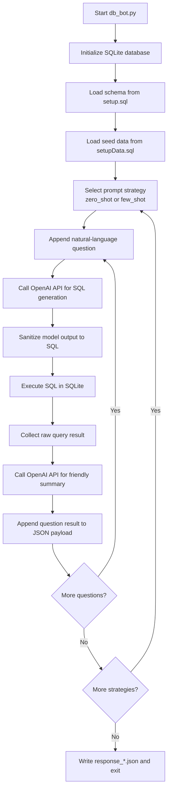

# Natural Language Database Querier

This project converts natural-language questions into SQLite queries, runs them against a sample project-management database, and then rewrites raw SQL results into concise natural-language answers.

## Project Purpose

The repository is a lightweight experiment to compare prompt strategies for NL-to-SQL:

- **Zero-shot**: schema + question
- **Few-shot**: schema + example Q&A + question

It evaluates how reliably an LLM can:

1. Generate valid SQLite `SELECT` statements
2. Return correct query results
3. Produce useful user-friendly responses

## Repository Structure

- `db_bot.py` - main execution script
- `setup.sql` - schema creation
- `setupData.sql` - seed data
- `questions_and_answers.md` - recorded question outcomes
- `schema.png` - schema image
- `response_*.json` - generated run artifacts

## Architecture

### High-Level Components

1. **SQLite bootstrap layer**
   - Recreates `aidb.sqlite`
   - Applies schema from `setup.sql`
   - Loads seed data from `setupData.sql`
2. **Prompting layer**
   - Builds prompts per strategy (`zero_shot`, `few_shot`)
   - Sends prompt + question to OpenAI Chat Completions API
3. **Execution layer**
   - Sanitizes model output to extract SQL
   - Executes SQL against SQLite
4. **Response layer**
   - Sends raw SQL result back to model for a concise natural-language answer
   - Stores all artifacts per strategy in timestamped JSON files

### Mermaid Diagram


```mermaid
flowchart TD
    A[Start db_bot.py] --> B[Initialize SQLite database]
    B --> C[Load schema from setup.sql]
    C --> D[Load seed data from setupData.sql]
    D --> E[Select prompt strategy<br/>zero_shot or few_shot]
    E --> F[Append natural-language question]
    F --> G[Call OpenAI API for SQL generation]
    G --> H[Sanitize model output to SQL]
    H --> I[Execute SQL in SQLite]
    I --> J[Collect raw query result]
    J --> K[Call OpenAI API for friendly summary]
    K --> L[Append question result to JSON payload]
    L --> M{More questions?}
    M -->|Yes| F
    M -->|No| N{More strategies?}
    N -->|Yes| E
    N -->|No| O[Write response_*.json and exit]
```

### Data Model (Relational)

- `Person` - people in the system
- `Project` - projects owned by a person
- `Tag` - reusable project tags
- `ProjectTag` - many-to-many mapping between projects and tags
- `PersonProject` - person participation in projects, role, and hourly rate
- `WorkSession` - time intervals worked by a person on a project

## Setup

1. Create `config.json` in the repository root:

```json
{
  "openaiKey": "YOUR_OPENAI_API_KEY"
}
```

2. Install dependencies:

```bash
pip install openai
```

3. Run the script:

```bash
python db_bot.py
```

## Output

Each run creates timestamped files like:

- `response_zero_shot_<timestamp>.json`
- `response_few_shot_<timestamp>.json`

Each output entry includes:

- original question
- model-generated SQL
- raw SQLite result
- friendly response
- error (if any)

## Known Evaluation Notes

See full examples in [`questions_and_answers.md`](./questions_and_answers.md).  
In the recorded runs, few-shot prompting is generally more reliable on joins and aggregate-style questions.