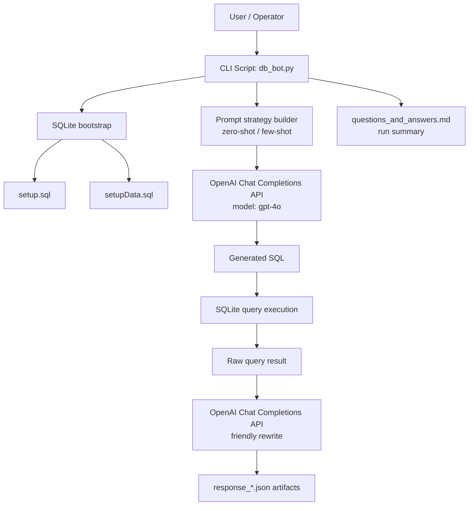

# System Overview

## Basic System Diagram

## Component Descriptions

1. **User / Operator**
   - Runs the local CLI process and provides required local configuration (`config.json`).
2. **CLI Script (`db_bot.py`)**
   - Orchestrates end-to-end execution: DB initialization, prompt assembly, API calls, SQL execution, and artifact generation.
3. **SQLite Bootstrap Layer**
   - Recreates `aidb.sqlite` on each run and loads schema/data from SQL scripts.
4. **Schema Definition (`setup.sql`)**
   - Defines relational objects (`Person`, `Project`, `Tag`, `ProjectTag`, `PersonProject`, `WorkSession`).
5. **Seed Data (`setupData.sql`)**
   - Loads sample project management records used for NL-to-SQL evaluation.
6. **Prompt Strategy Builder**
   - Builds prompt prefixes for zero-shot and few-shot SQL generation.
7. **OpenAI API (SQL generation step)**
   - Receives schema/context + natural language question and returns SQL text.
8. **SQL Sanitization/Execution Layer**
   - Strips code fences from model output and executes SQL against SQLite.
9. **OpenAI API (friendly response step)**
   - Rewrites raw tuple output into concise natural-language wording.
10. **Artifacts (`response_*.json`, `questions_and_answers.md`)**
   - Stores per-question SQL, raw output, friendly output, and errors.

## Data Flow Summary

1. Operator starts `db_bot.py`.
2. Script builds a fresh SQLite DB from `setup.sql` and `setupData.sql`.
3. For each strategy and question, prompt text is sent to OpenAI.
4. Returned SQL is sanitized and executed on SQLite.
5. Raw results are sent to OpenAI for concise response rewriting.
6. Run outputs are written into JSON evidence files and summarized in markdown.
